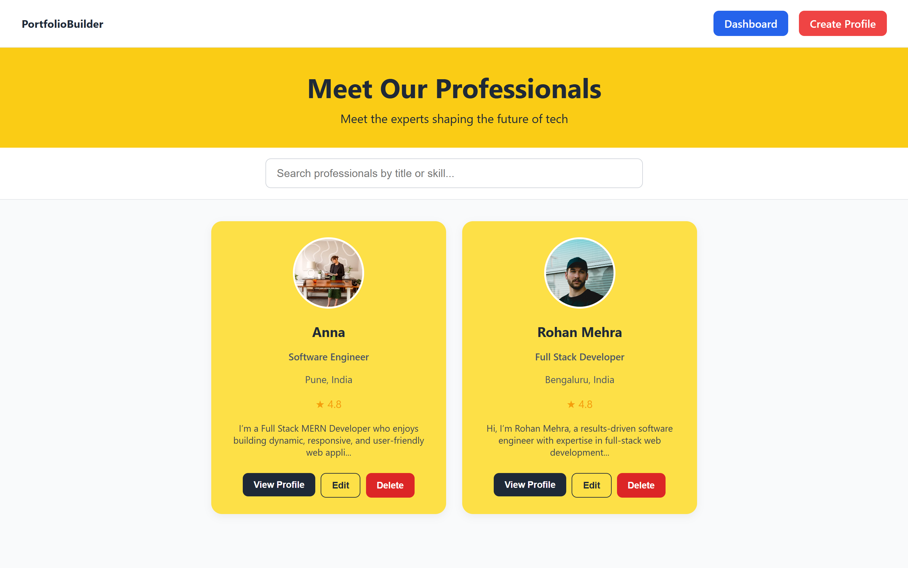
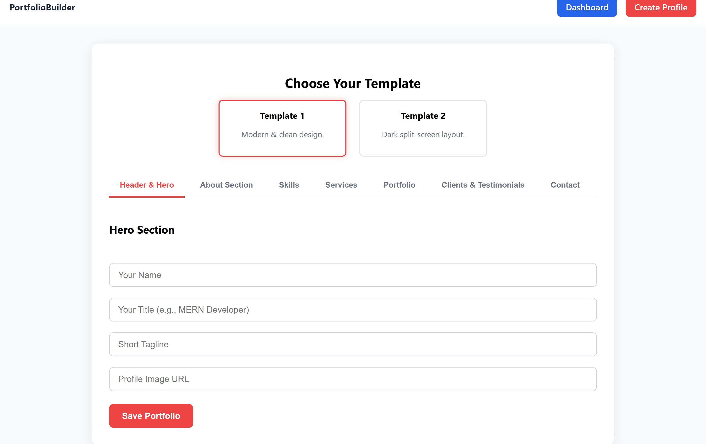
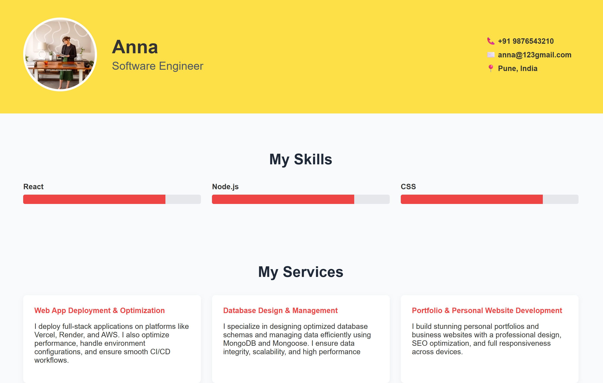
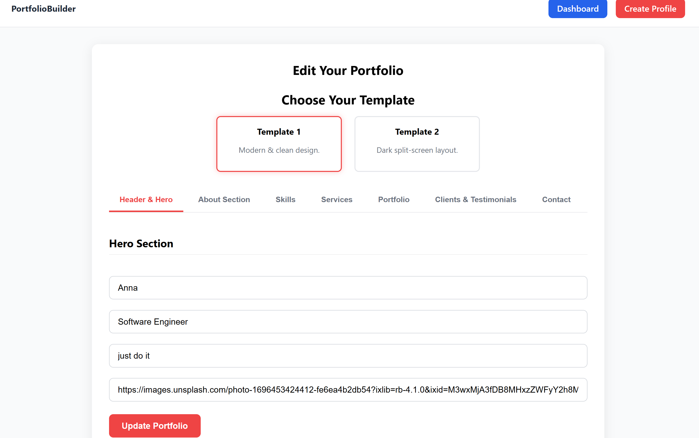
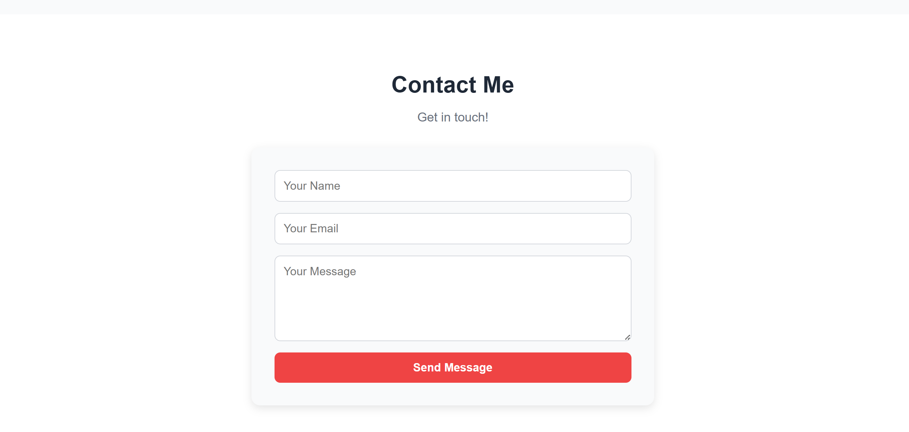

# Dynamic Portfolio App

A **React-based dynamic portfolio generator** where users can select a template, fill out a multi-section form, and generate a professional portfolio. The submitted data is displayed as a profile card, and users can view a full portfolio page rendered with the chosen design template.

## 🔹 Objective
Build a React app where users can:
1. Select a portfolio template.
2. Fill a detailed multi-section form.
3. See their profile displayed as a card.
4. View a dynamic portfolio page generated using the selected template.

## 🔹 Features
- **Template Selection:** Choose between 2 professional portfolio templates before filling the form.
- **Multi-section Form:**  
  - **Hero Section:** Name, Title, Tagline, Profile Image  
  - **About Me:** Bio, Email, Phone, Location, Social Links  
  - **Skills:** Add list of skills/tags  
  - **Services:** Up to 3 services with Title & Description  
  - **Portfolio:** 3 projects with Title, Image, Description  
  - **Testimonials:** 1–3 client quotes  
  - **Blog (optional):** Title & Summary  
  - **Contact:** Message, Email, Phone
- **Profile Card Listing:**  
  After submission, displays a profile card with Name, Role, Bio, Skills, and a "View Portfolio" button.

- **Dynamic API Integration:**  
  - **POST API:** Store form-submitted portfolio data.  
  - **GET API:** Fetch data dynamically to render on the listing and portfolio pages.  
  - No static/local-only state; all content is reflected in real-time from API responses.

- **Additional Features:**  
  - Edit profile  
  
- **Technologies Used
Frontend: React.js, HTML5, CSS3, JavaScript
Backend/API: Node.js / Express.js (or your API endpoint)
Database: MongoDB / Firebase (if used)
Tools: Git, VS Code, Postman

## Screenshots
Here's what the project looks like:

dynamic-portfolio-app/
├── public/
│   └── index.html
├── src/
│   ├── api/          # API calls (axios/fetch)
│   ├── assets/       # Images, icons, logos
│   ├── components/   # Reusable UI parts (Header, Footer, Cards)
│   ├── pages/        # Full pages (Home, Portfolio, Contact)
│   ├── styles/       # CSS or Tailwind files
│   ├── App.js
│   └── index.js
├── screenshots/      # For README images
├── .gitignore
├── package.json
└── README.md

